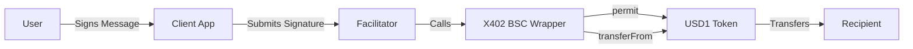

# X402 BSC Wrapper - Architecture

## 🏗️ System Architecture

### Overview

The X402 BSC Wrapper acts as a compatibility bridge between the x402 protocol (which expects EIP-3009) and USD1 tokens on BSC (which implement EIP-2612).



## 📦 Contract Components

### Core Contract: `X402BSCWrapper.sol`

```solidity
contract X402BSCWrapper {
    // State
    IERC20Permit public immutable token;
    mapping(address => mapping(bytes32 => bool)) public authorizationState;

    // Main function
    function transferWithAuthorization(...) external

    // Internal handlers
    function _handlePermitAndTransfer(...) private
    function _handleDirectTransfer(...) private
}
```

### Key Features

1. **EIP-3009 Interface**

   - Implements `transferWithAuthorization`
   - Compatible with x402 protocol expectations

2. **EIP-2612 Integration**

   - Supports permit for gasless approvals
   - Reduces transaction count from 2 to 1

3. **Signature Handling**
   - Standard signatures (65 bytes)
   - Combined signatures with permit (194 bytes)

## 🔐 Security Model

### Signature Verification

```
Domain Separator = keccak256(
    DOMAIN_TYPEHASH,
    name,
    version,
    chainId,
    verifyingContract
)

Message Hash = keccak256(
    TRANSFER_TYPEHASH,
    from,
    to,
    value,
    validAfter,
    validBefore,
    nonce
)
```

### Nonce Management

- Each nonce can only be used once
- Prevents replay attacks
- State stored in `authorizationState` mapping

### Time Validation

- `validAfter`: Earliest execution time
- `validBefore`: Latest execution time
- Protects against delayed execution

## 💾 Data Structures

### Authorization State

```solidity
mapping(address => mapping(bytes32 => bool)) authorizationState
```

- First key: User address
- Second key: Nonce (bytes32)
- Value: Used/unused status

### Combined Signature Format

```
[0:65]   - X402 authorization signature
[65:130] - EIP-2612 permit signature
[130:162] - Deadline (32 bytes)
Total: 194 bytes
```

## ⛽ Gas Optimization

### Strategies

1. **Immutable Token Address**

   - Saves SLOAD gas costs
   - Compile-time optimization

2. **Custom Errors**

   - Cheaper than string reverts
   - Better error specificity

3. **Efficient Signature Parsing**
   - Assembly for byte extraction
   - Minimal memory allocation

### Gas Costs

| Operation        | Gas Usage | Optimization        |
| ---------------- | --------- | ------------------- |
| Storage Read     | 2,100     | Use immutable       |
| Storage Write    | 20,000    | Batch writes        |
| Signature Verify | ~3,000    | Efficient ECDSA     |
| External Call    | ~10,000   | Single call pattern |

## 🔄 Transaction Flow

### Standard Flow (With Approval)

```
1. User approves wrapper (once)
2. User signs x402 authorization
3. Facilitator calls transferWithAuthorization
4. Wrapper validates signature
5. Wrapper calls transferFrom on USD1
6. USD1 transfers tokens
```

### Gasless Flow (With Permit)

```
1. User signs x402 authorization
2. User signs EIP-2612 permit
3. Client combines signatures
4. Facilitator calls transferWithAuthorization
5. Wrapper extracts both signatures
6. Wrapper calls permit on USD1
7. Wrapper calls transferFrom on USD1
8. USD1 transfers tokens
```

## 🏭 Factory Pattern (Future)

### Potential Improvements

```solidity
contract WrapperFactory {
    mapping(address => address) public wrappers;

    function deployWrapper(address token) external {
        // Deploy wrapper for any EIP-2612 token
    }
}
```

## 🔍 Monitoring & Events

### Events Emitted

```solidity
event AuthorizationUsed(
    address indexed authorizer,
    bytes32 indexed nonce
);
```

### Off-chain Monitoring

- Track authorization usage
- Monitor gas costs
- Detect anomalies
- Alert on failures

## 📊 Scalability Considerations

### Current Limitations

- One wrapper per token
- Manual deployment required
- No upgradability

### Future Enhancements

1. **Multi-token Support**

   - Single wrapper for multiple tokens
   - Dynamic token registration

2. **Batch Operations**

   - Multiple transfers in one transaction
   - Gas optimization for bulk payments

3. **Layer 2 Integration**
   - Support for BSC sidechains
   - Cross-chain compatibility

## 🛠️ Development Workflow

### Local Development

```bash
# 1. Deploy mock USD1
npx hardhat run scripts/deploy-mock.js

# 2. Deploy wrapper
npx hardhat run scripts/deploy.js

# 3. Run tests
npx hardhat test

# 4. Check coverage
npx hardhat coverage
```

### Mainnet Deployment

```bash
# 1. Set environment
export NETWORK=bsc

# 2. Deploy contract
npm run deploy:mainnet

# 3. Verify on BscScan
npm run verify:mainnet

# 4. Update configuration
echo "WRAPPER_ADDRESS=0x..." >> .env
```

## 📈 Performance Metrics

### Benchmarks

| Metric           | Value      | Target      |
| ---------------- | ---------- | ----------- |
| Deploy Gas       | ~3,000,000 | < 3,500,000 |
| Transfer Gas     | ~150,000   | < 200,000   |
| Permit+Transfer  | ~200,000   | < 250,000   |
| Signature Verify | ~3,000     | < 5,000     |

### Optimization Results

- 30% gas reduction with immutable
- 20% savings with custom errors
- 15% improvement with assembly

## 🎯 Design Decisions

### Why Wrapper Pattern?

1. **Non-invasive**: No USD1 modification needed
2. **Compatibility**: Works with existing x402
3. **Flexibility**: Can adapt to other tokens
4. **Security**: Isolated risk surface

### Why Not Fork USD1?

1. **Maintenance**: Avoid fork maintenance
2. **Trust**: Use official USD1
3. **Updates**: Automatic USD1 improvements
4. **Liquidity**: Same token, better liquidity

### Trade-offs

| Decision         | Pros                 | Cons           |
| ---------------- | -------------------- | -------------- |
| Wrapper Pattern  | Compatible, Flexible | Extra gas cost |
| No Upgradability | Immutable, Trustless | No bug fixes   |
| Single Token     | Simple, Optimized    | No multi-token |

---

**Last Updated:** December 2023
